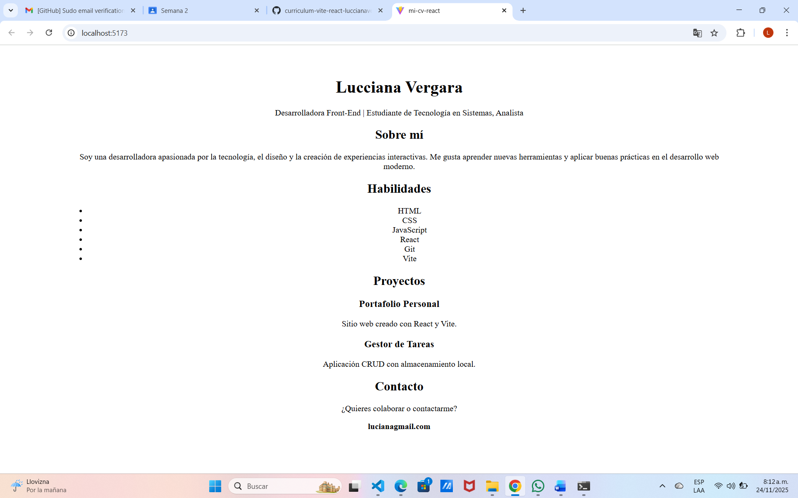

# Mi-cv-react, luciana vergara

# commits 

# instruccciones para ejecutar el proyecto
cree unos componentes los cuales son los que contiene mi hoja de vida, los importe luego les hice commit y por ultimo corri la aplicación con npm run dev
