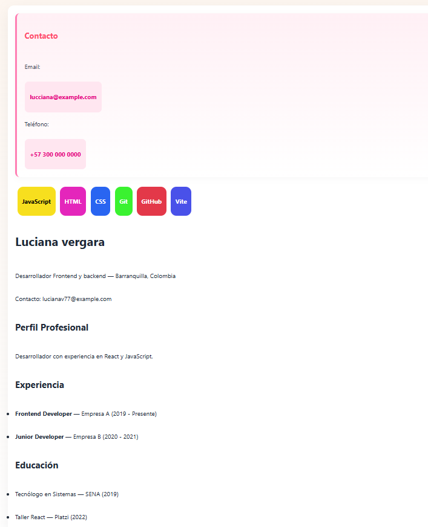

# Mi-cv-react, luciana vergara

# commits 

# instruccciones para ejecutar el proyecto
cree unos componentes los cuales son los que contiene mi hoja de vida, los importe luego les hice commit y por ultimo corri la aplicación con npm run dev, agrege otro componente llamado StackTecnologias y le puse un breve estilo y realice los commits que se estaban requiriendo
 # interfaz con los props ya añadidos
 